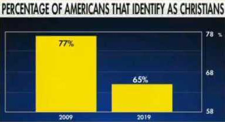
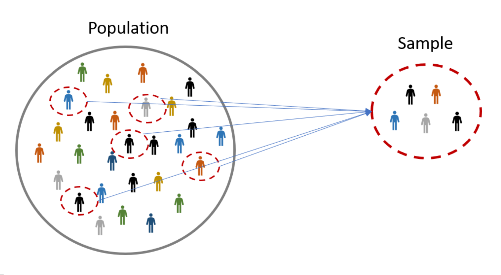

# Introduction To Statistics {#intro}


## Statistics

Statistics is the science of converting *data* into *knowledge*. 

What exactly is data? 

- A set of values corresponding to objects. 
- Genetic sequence of a person 
- Stock prices over time 
- Literacy rates of different groups 
- A person's search history 
- ...

Data can be dense and un-interpretable. The R dataset \texttt{mtcars} contains design aspects for several automobiles.


```
##                      mpg cyl  disp  hp drat    wt  qsec vs am gear carb
## Mazda RX4           21.0   6 160.0 110 3.90 2.620 16.46  0  1    4    4
## Mazda RX4 Wag       21.0   6 160.0 110 3.90 2.875 17.02  0  1    4    4
## Datsun 710          22.8   4 108.0  93 3.85 2.320 18.61  1  1    4    1
## Hornet 4 Drive      21.4   6 258.0 110 3.08 3.215 19.44  1  0    3    1
## Hornet Sportabout   18.7   8 360.0 175 3.15 3.440 17.02  0  0    3    2
## Valiant             18.1   6 225.0 105 2.76 3.460 20.22  1  0    3    1
## Duster 360          14.3   8 360.0 245 3.21 3.570 15.84  0  0    3    4
## Merc 240D           24.4   4 146.7  62 3.69 3.190 20.00  1  0    4    2
## Merc 230            22.8   4 140.8  95 3.92 3.150 22.90  1  0    4    2
## Merc 280            19.2   6 167.6 123 3.92 3.440 18.30  1  0    4    4
## Merc 280C           17.8   6 167.6 123 3.92 3.440 18.90  1  0    4    4
## Merc 450SE          16.4   8 275.8 180 3.07 4.070 17.40  0  0    3    3
## Merc 450SL          17.3   8 275.8 180 3.07 3.730 17.60  0  0    3    3
## Merc 450SLC         15.2   8 275.8 180 3.07 3.780 18.00  0  0    3    3
## Cadillac Fleetwood  10.4   8 472.0 205 2.93 5.250 17.98  0  0    3    4
## Lincoln Continental 10.4   8 460.0 215 3.00 5.424 17.82  0  0    3    4
## Chrysler Imperial   14.7   8 440.0 230 3.23 5.345 17.42  0  0    3    4
## Fiat 128            32.4   4  78.7  66 4.08 2.200 19.47  1  1    4    1
## Honda Civic         30.4   4  75.7  52 4.93 1.615 18.52  1  1    4    2
## Toyota Corolla      33.9   4  71.1  65 4.22 1.835 19.90  1  1    4    1
## Toyota Corona       21.5   4 120.1  97 3.70 2.465 20.01  1  0    3    1
## Dodge Challenger    15.5   8 318.0 150 2.76 3.520 16.87  0  0    3    2
## AMC Javelin         15.2   8 304.0 150 3.15 3.435 17.30  0  0    3    2
## Camaro Z28          13.3   8 350.0 245 3.73 3.840 15.41  0  0    3    4
## Pontiac Firebird    19.2   8 400.0 175 3.08 3.845 17.05  0  0    3    2
## Fiat X1-9           27.3   4  79.0  66 4.08 1.935 18.90  1  1    4    1
## Porsche 914-2       26.0   4 120.3  91 4.43 2.140 16.70  0  1    5    2
## Lotus Europa        30.4   4  95.1 113 3.77 1.513 16.90  1  1    5    2
## Ford Pantera L      15.8   8 351.0 264 4.22 3.170 14.50  0  1    5    4
## Ferrari Dino        19.7   6 145.0 175 3.62 2.770 15.50  0  1    5    6
## Maserati Bora       15.0   8 301.0 335 3.54 3.570 14.60  0  1    5    8
## Volvo 142E          21.4   4 121.0 109 4.11 2.780 18.60  1  1    4    2
```

We might want to know something about this data - for example, how does the weight of a car relate to its miles per gallon?  We can't tell just by reading this chunk of raw data with human eyes.  Statistical methods distill the data into useful, interpretable figures.

---

Why study statistics?  In addition to being a powerful tool for understanding patterns, statistics is ubiquitous in academic research and other contexts.  This is a double-edged sword...

<!-- -->

## Key terms

:::: {.infobox .deff data-latex=""}
We begin by asking a question about a **population** of interest.  A population is made up of all individuals.
::::

- For example, all US males, all microbes in a dish, all bolts from a factory.

Populations are almost always too large to study entirely.  If we could measure every object in a population, we would have no need for statistics!

:::: {.infobox .deff data-latex=""}
In practice, to answer our question of interest, we need to take a **sample** from the population. These are the units that are actually observed.
::::

- The sample should be representative of the population.
- For example, pick 100 US males at random.

By definition, sampling introduces uncertainty, because we are only looking at a small portion of the population.  Statistical methods use probability (the mathematics of randomness) to deal with this uncertainty in a principled way.

<!-- -->

How can we make sure the sample is representative?

:::: {.infobox .deff data-latex=""}
One strategy is a **simple random sample** (SRS).  In an SRS, every group of size $n$ (sample size) from the population is equally likely to be drawn.
::::

Taking a SRS means we are choosing items completely at random.

:::: {.infobox .exer data-latex=""}
2000 patients (1350 with high cholesterol, 650 without) agreed to participate in a cholesterol drug trial. How can we take a SRS?

- The last 200 patients to sign up are chosen.
- A computer produces 200 random values between 1 and 2000, and those patients are chosen.
- A computer produces 200 random values between 1 and 1350, and those patients with high cholesterol are chosen.
- A proportional number of patients with high cholesterol and normal cholesterol are chosen.

<span style="color:#8601AF">
The second scenario is a SRS.
</span>
::::

---

Now let's go back to the question of interest. We often want to know about a specific numeric value. For example, the average height of all US males.

:::: {.infobox .deff data-latex=""}
A **parameter** is a numeric summary of the population.
::::

Remember, we can't study the entire population.  So we don't know what the value of the parameter is!  However, we *can* measure this value for our observed sample. It is complete feasible to measure the height of 100 US males.

:::: {.infobox .deff data-latex=""}
A **statistic** is the corresponding numeric summary of the sample.
::::

We calculate a statistic and use it to learn about the parameter via estimation.

**P**arameter describes the **P**opulation, **S**tatistic describes the **S**ample.

---

The way the sample was collected will influence the scope of our conclusions. Suppose medical researchers were trying to study the effect of a certain drug. What's the best way to do this?  Who should they assign to take the drug?

There are two broad categories of studies that produce data.

:::: {.infobox .deff data-latex=""}
In an **experimental study**, researchers assign individuals in the experiment to groups in a way that makes the experimental conclusions valid.
::::

Medical researchers studying a drug could assign one group of individuals to take a drug treatment, and another group to take a control. They choose who goes into each group.  In general, for an experimental study, the researcher actively manipulates certain variables, then records the values of the variables of interest.

:::: {.infobox .deff data-latex=""}
In an **observational study**, the data has already been collected in the past, and the researchers don't decide who takes the medicine.
::::

Medical researchers might read through the medical records of patients who took the drug treatment.  In general, for an observational study, the researcher gathers data without interfering with the process that generated the data.  The data has already been collected in the past.

With an experimental study, we can make stronger conclusions about the population than an observational study.  However, experimental studies are much more expensive and work-intensive to perform.  The examples in this class will be observational. 

:::: {.infobox .pond data-latex=""}
If the researchers were doing an observational study of the drug, what are some confounding factors from the patients' medical records that might make it difficult to draw conclusions about the drug effect specifically?
::::

:::: {.infobox .exer data-latex=""}
Are the following studies experimental or observational?

- Volunteers who suffer from headaches were randomly assigned to three groups. One group received an herbal treatment, the second received a drug treatment, and the third received a placebo. The volunteers reported their decrease headaches over the course of the trial. 
- The gripping strengths of 10 left-handed writers were measured and compared to the gripping strength of 10 right-handed writers. 
- A researcher stands at a busy intersection and records the color of each automobile that goes through the intersection on yellow or red lights. 

<span style="color:#8601AF">
First exmaple is experimental, second and third are observational.
</span>
::::

## Types of data

There are several different types of data. Knowing the type you're working with is key to identifying the appropriate statistical methods to use. The first type of data is **numeric**.

- Examples of numeric data: height, time, number of meals per day

:::: {.infobox .deff data-latex=""}
Numeric data is quantitative - it deals with numbers. There are two subtypes of numeric data.

- **Continuous** data can take on any value in a range. It can be measured to any degree of accuracy (length, time, etc.)

- **Discrete** data can only take on specific values.  We can "list out" the possible values.  "Number of tornadoes in Madison in a year" is discrete because it can take on values 0, 1, 2, etc.
::::

Most of the methods in this class deal with numeric data.

---

The second type of data is **categorical**.  

- Examples of categorical data: ethnicity, sex, favorite color.

:::: {.infobox .deff data-latex=""}
Categorical data is qualitative - it deals with categories of things that can't be described numerically.  There are two subtypes of categorical data.

- **Nominal** data has no natural ordering.  "Eye color" is nominal.

- **Ordinal** data does have a natural ordering.  Likert scale data is a good example.  When given the statement, "Statistics class is fun!", you can respond with "strongly disagree", "disagree", "agree", or "strongly agree".  "Disagree" is a more positive sentiment than "strongly disagree", "agree" is more positive than "disagree", etc.
::::

Sometimes groups are given numbers for convenience, but that does not make them numeric.  "Group 1" and "Group 2" are still categories, because they don't mean anything on the number line.

:::: {.infobox .exer data-latex=""}
Identify the  data type for 6 variables that could be recorded on a set of students.

- Height
- Name
- Taken prior stats class or not
- Wrist circumference
- Number of siblings
- Letter grade in a course

<span style="color:#8601AF">
Height and circumference are continuous, number of siblings is discrete, name and prior class are nominal, and letter grade is ordinal.
</span>
::::

:::: {.infobox .pond data-latex=""}
We can argue that ordinal data can be represented as discrete numeric data.  For example, assign "strongly disagree", "disagree", "agree", and "strongly agree" to the numeric values 1, 2, 3, and 4.  Why might we want to do this?  Why might this be a bad idea?
::::

## Course outline

We'll start by laying the foundations of statistics and probability.  These are the basic tools and definitions that we'll be seeing over the whole semester.

Next, we'll look at the more gritty mathematical theory that makes statistics possible.  This will give us the backround to really understand statistical methods, rather than just memorizing them.

Most of the class will cover different statistical methods.  These are the tools that we can directly apply to real-world data to answer resarch questions.

<!-- -->


